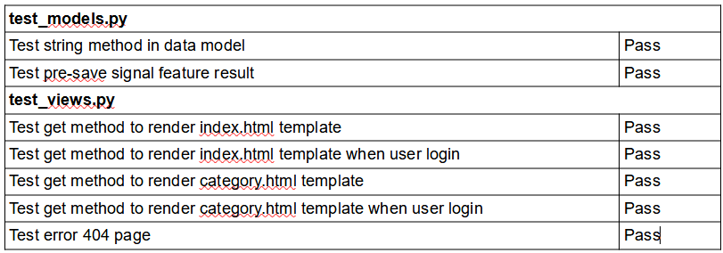
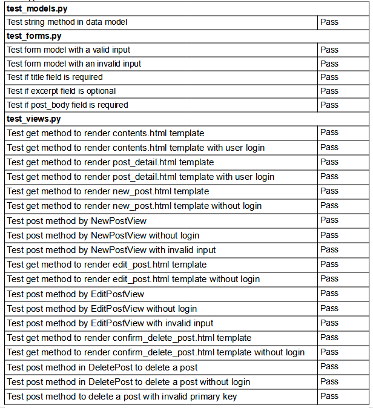
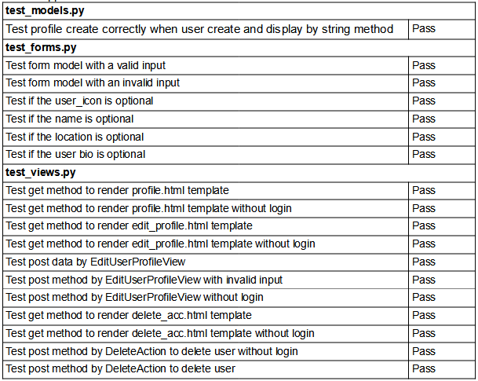
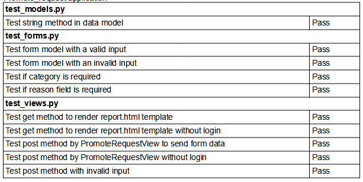
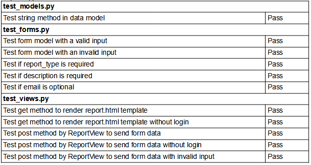
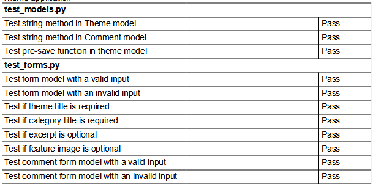
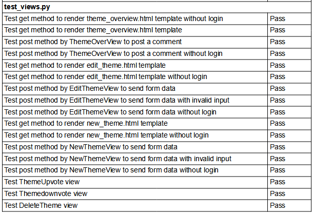

# TALES - A content share community
# Portfolio Project 4
Tales is a website focus on content creation and experience sharing.\
Creators can publish their story, creation and experience to the platform and begin a conversation about their contents.\
And the other member can leave their comment to react to the creators.\
You can click [here](https://ci-portfolio-project-4.herokuapp.com/) to the living website.\
Active website: 

## **Table of Contents**

* [User Experience Design](#User-Experience-Design)
* [Feature](#Feature)
* [Testing](#Testing)
* [Deployment](#Deployment)
* [Technologies](#Technologies)
* [Credits](#Credits)

 

## **User Experience Design**
### **The Strategy Plane**

Tales is a request come from a anonymous group who want to create and share their own content but found themselves always be remove their posts by website owners because of their personal policies even their creations are just express their personal opinions. Although they still have other platforms to share their experience and gain a huge amount of subscribers, they still want to own a website to share their works.

Because of that, their first priority is not about payment method or security. They just need a platform simple enough to save their work and manage their creations. And build a small community to discuss their process.

And my aim is to build a responsive application that can share contents and allow to build an internal community. User should seperate into three user group: admin, creator and member to clarify their role in their community. The creator should have right to manage their own creations and member should only have right to leave comments for the contents. The admin should have right same as creator and have right to use django's admin panel. The member should only have right to report and comment contents. One of the important thing is the website should be as simple as possible because it is jsut a website for internal use, they still working on their own chat group and their offical fanpage on social media for their business.

 

#### **Site Goal**

 - User validation to grant user to have right to share content and leave comments.  
 - A website with user interface to view and manage contents.  
 - Provide few forms to let user communicate wtih website admin.

 

#### **User Stories**

 - As a user, I can see the most upvoted posts on the top of the list on the landing page so that I can know the trend of the community.
 - As a user, I can view the list of themes order by the updated time so that I can know what's the latest content in the website.
 - As a user, I can click on a theme so that I can view the overview page with all comments.
 - As a user, I can view the list of posts ordered by created date so that I can read the content from latest to oldest.
 - As a user, I can click on a post so that I can read the full content of the post.
 - As a user, I can view the number of likes and comments so that I can see which is the most popular or viral.
 - As a user, I can click the signup button in the navbar to register an account so that I can join the community as my own identity.
 - As a user, I can click the category button in nav bar so that I can view different types of content.
 - As an admin/creator/member, I can create, read, update, delete my own profile so that the other users can know something about me.
 - As an admin/creator/member, I can change my account's password so that I can protect my account.
 - As an admin/creator/member, I can delete my account so that I can be free to join and leave the community.
 - As an admin/creator/member, I can upvote/downvote themes so that I can interact with the discussion.
 - As an admin/creator/member, I can leave my own comment on the theme page so that I can be involved in the discussion.
 - As an admin/creator/member, I can submit a form to report some sensitive/offensive content that makes me feel offended and disturbed.
 - As an admin, I can access the control panel to have full control of the website database so that I can manage the content.
 - As an admin, I can promote/demote users so that I can manage different user groups.
 - As an admin, I can search and use filters to view the data so that I can manage the database easier.
 - As an admin/creator, I can create, update, and delete my own posts and themes so that I can manage my own content.
 - As a member, I can submit a form to send requests so that I can become the creator to share my content.
 
 

### **Scope Plane**

Planned Features the website should have:
 - Responsive Design
 - Navigation Bar
 - Category page to filter the type of contents
 - User validation
 - Different user group
 - Profile image upload
 - Cover image upload
 - Article overview
 - Comments
 - Display full contents of the posts
 - User interfaces to manage their articles and contents
 - Admin platform to manage the database records
 - Filter and search function in admin platform
 - Form to report contents
 - Form to send a request to admin to grant a creator role

 

### **Structure Plane**

User Story:
> As a user, I can see the most upvoted posts on the top of the list on the landing page so that I can know the trend of the community.

Acceptance Criteria:\
Landing page should have a component display one or more image or information about the most up-voted article.

Implementation:
 - On the top of the landing page, a section contain with a carousel display the feature image of top-3 upvoted articles.
 - User can browse these articles through click on the carousel images.

 

User Story:
> As a user, I can view the list of themes order by the updated time so that I can know what's the latest content in the website.

Acceptance Criteria:\
Website should have at least a section to display a list of theme order by the update time.

Implementation:
 - The full list of data store in a paginator object and display on the landing page.\
 - The paginator stored 10 of list items for each page.
 - The list item order by the last update time that make them can easily find the latest updated contents.

 

User Story:
> As a user, I can click on a theme so that I can view the overview page with all comments.

Acceptance Criteria:\
When user click on a theme, they should browse a page with some information about the theme and see all the comments underneath the button section.

Implementation:\
theme_overview template have four section:
 - First section display the information about the selected theme
   - Those information included title, author, category, excerpt, created date and last updated date.
   - A feature image will show in the same section.
   - The page's border color will change depends on which category it belongs to.
 - Second section display the excerpt of the theme
   - The excerpt will display in this section.
   - If user do not write any excerpt a message will be shown.
 - Third section display all the button user can use
   - Unauthorized user only can see a read button to table of contents page.
   - User login as member can see read and report button in this section
   - User login as creator and admin also can see read and report button, \
     but if they are the author of the theme they can see 3 more button to create post, \
     edit theme information and remove the theme.
 - Fourth section is about all the comments of the theme
   - The comment will be all list underneath the first section.
   - Each comment will display the user name or display name of who comment the theme.
   - Each comment will display the comment date and last update date on the cards.
   - If no any comment this section will display a message 'Here is no any comment yet'.

 

User Story:
> As a user, I can view the list of posts ordered by created date so that I can read the content from latest to oldest.

Acceptance Criteria:\
User should can see a full list of post to discover the contents of the theme.

Implementation:
 - When user click on the button in theme_overview template, user can enter the table of contents page.
 - The full list of post data store in a paginator object.
 - The paginator stored 10 of list items for each page.
 - User can click the list item to read full content of the post.
 - The page also have a nav bar and have the previous, next page(if have), and a return button to return the overview page.

 

User Story:
> As a user, I can click on a post so that I can read the full content of the post.

Acceptance Criteria:\
When user click on the link in table of contents,\
they should be allowed to view the full content with correct template.

Implementation:
 - When user click on the post in the post list, the view in post application will render post_detail template,\
 - Template will show the full content and a nav bar than can return to previous page, next page,\
and return to the contents page.

 

User Story:
> As a user, I can view the number of likes and comments so that I can see which is the most popular or viral.

Acceptance Criteria:\
User should be allowed to view the number of upvote, downvote and comments before and after they click to view the information of the theme.

Implementation:
 - On the landing page and category page, each list item will display as a card, and the number of upvote, downvote and comments will show on the card's footer.
 - On the theme overview page's first section, the count of these information also display on the page.

 

User Story:
> As a user, I can click the signup button in the navbar to register an account so that I can join the community as my own identity.

Acceptance Criteria:\
User should find a login and singup button on the nav bar, if user have already login, they can find some message to show they have successfully login and a logout button.

Implementation:
 - We use allauth library to handle all function related to account validation.
 - Related template have already been stlyed.
 - First I try to add a welcome message when user successfully login, but soon I found that display a link to profile with text of the user name on the nav bar could make the nav bar clean.
 - On the right side in the desktop version, user can find a login and signup button if they do not login to the website.
 - If user visit to the website with smaller screen, user can click the toggler button to view the list of the links, the login, logout, signup button and the profile link are display as requirement.

 

User Story:
> As a user, I can click the category button in nav bar so that I can view different types of content.

Acceptance Criteria:\
User should find the button to different category page to see filtered list of content.

Implementation:
 - A static pull down list add to the nav bar, user can view different links to the catorgies.
 - If user click on the link they can view the category page.
 - Border color will change in different category.
 - The requirement list of data store in a paginator object.
 - The paginator stored 10 of list items for each page.
 - The page also have a nav bar and have the previous, next page(if have), and a return button to return the overview page.

 

User Story:
> As an admin/creator/member, I can create, read, update, delete my own profile so that the other users can know something about me.

Acceptance Criteria:\
User should have right to view his profile record store in database, and have right to mangage it.

Implementation:
 - A almost blank profile record are auto-created when user register their new account.
 - When user Login, they can click the link display as their user name to view their profile.
 - In the profile page, they can see the update and delete button to manage their profile information.
 - The update page use a form model to validate the user input, if the form is valid, their data in database will be correctly changed.
 - Once user click the delete account button and confirm their action, their profile information will be remove with their account.

 

User Story:
> As an admin/creator/member, I can change my account's password so that I can protect my account.

Acceptance Criteria:\
User should be allowed to change their password, and the change password page should only can browse after login.

Implementation:
 - We use allauth library to handle all function related to account validation.
 - Related template have already been stlyed.
 - The change password button finally place on the profile page, that make in general usage, user are only can visit this page after login.

 

User Story:
> As an admin/creator/member, I can delete my account so that I can be free to join and leave the community.

Acceptance Criteria:\
User should be allowed to delete their account and all related data when they want to leave the community.

Implementation:
 - The remove account button place on the profile page
 - Once they click the button, they will see a confirm page to show warning text, a return button and a delete button.
 - User can press the return button to back to profile page.
 - When user confirm to remove their account, a model component will pop up for the final confirmation.
 - User can press close button to close the model component, or press delete to remove their account.
 - After remove the action, the view will redirect user to landing page with a message to show the result of the action. 

 

User Story:
> As an admin/creator/member, I can upvote/downvote themes so that I can interact with the discussion.

Acceptance Criteria:\
An upvote button and a downvote button should exist in the same page and allowed authorized user to upvote/downvote a theme.

Implementation:
 - The upvote and downvote buttons are place on the theme_overview template.
 - The unauthorize user will see the count of the upvote, downvote and comments with icons,\
   but there will not display a button to let them use upvote and downvote functions.
 - Authorize user will discover the upvote and downvote icon turn to a button, \
   they can click the button to upvote or downvote the theme or undo their action.

 

User Story:
> As an admin/creator/member, I can leave my own comment on the theme page so that I can be involved in the discussion.

Acceptance Criteria:\
The website should allowed authorize user to leave comment of the contents, \
and the comment form should in the same page with all comments from all members.

Implementation:
 - In theme_overview template, under the button section, \
   authorize user can see a form with textfield generate by crispy form library, \
   they can leave comment on the textview and leave comment on the theme.
 - If user are unauthorized, they can only see all the comments on the page, \
   they will not allowed to use the comment form to leave comments.

 

User Story:
> As an admin/creator/member, I can submit a form to report some sensitive/offensive content that makes me feel offended and disturbed.

Acceptance Criteria:\
All user in different group should allowed to use a report form to submit some data about the sensitive/offensive article or contents they want to report.

Implementation:
 - In the theme_overview page, authorized user could find a link button to the report page.
 - Report page contain a form genereate by crispy form and a return link return to overview page.
 - If form is valid, success message will display and re-render the overview page, \
   and the data will send to the database and admin can check the data in default admin platform.
 - If form is invalid, a warning message will display and redirect to overview page
 - Authorized user can fill and submit a form to report sensitive/offensive contents, \
   unauthorized user will redirect to the login page.

 

User Story:
> As an admin, I can access the control panel to have full control of the website database so that I can manage the content.

Acceptance Criteria:\
Admin should allowed to use the admin platform to manage the records in database.

Implementation:
 - Admin can login the django build-in admin platform to manage the data directly.

 

User Story:
> As an admin, I can promote/demote users so that I can manage different user groups.

Acceptance Criteria:\
Admin should have different ways to change the user's user group by the admin platform.

Implementation:
 - A customer action have been added in action list by modify admin.py, \
   admin can use these two customer action to promote/demote users.
 - Admin also can directly change the profile data to manage the user group.

 

User Story:
> As an admin, I can search and use filters to view the data so that I can manage the database easier.

Acceptance Criteria:\
Django default admin platform should have filters and a search bar on each page display the table in the database.

Implementation:
 - By modify admin.py in all application which have a data model, \
   admin can use the search and filter function by specific column.
 - The search bar should be found on the top of the data list, and the filter should display on right of the list.

 

User Story:
> As an admin/creator, I can create, update, and delete my own posts and themes so that I can manage my own content.

Acceptance Criteria:\
If the user is the author of the theme, they should be allowed to create, update and delete their own creation. These two user group also should have right to create a new theme and modify their contents information.

Implementation:
 - Theme
   - After user login, if user's user group is creator or admin, a link to create a new theme will appear on the nav bar.
   - User can submit a form to create a new theme with the form in new_theme template.
   - Form generate by crispy form, title and category field is required, and excerpt and feature field is an optional input.
   - User can update their own image to cloudinary to become the feature image.
   - In the overview page, if user is the author of the theme, they can see a button to edit_theme template. \
   - User can update the information of the theme by submit the form in edit_theme template.
   - If user click the delete theme button, a model will pop up to the front, \
     user can close the model or press the delete button on the model to remove the theme.
 - Post
   - After user login, if user is the author of the theme, the page will display a button to create a new post.
   - User can submit a form to create a new post with the form in new_post template.
   - Form generate by crispy form, title and content field is required, and excerpt field is an optional input.
   - Inside the table of contents page, each list item display as cards, if user is the author of the theme,\
     the link to edit and delete post function will show on the card's footer.
   - When user click the edit button, they can submit a form to update the post.
   - When user click the delete button, they will see a confirm page before actually remove the post,\
     they can click the return button and back to the table of contents, or click the delete to confirm the action.

 

User Story:
> As a member, I can submit a form to send requests so that I can become the creator to share my content.

Acceptance Criteria:\
If user's user group belongs to member, they should have right to submit a form to contact website admin to change their user group.

Implementation:
- In the profile page, if user's user group is member, the page will display a button to promote request template.
- User can fill and submit the form to submit the request to database.
- When user click the submit button, the page will redirect to profile page, \
  and display the result as messages.

### **Skeleton Plane**

#### **Wireframes**
 - index

 

 - category

  

 - theme_overview

  

 - new_theme/edit_theme

  

 - contents

  

 - new_post/edit_post

  

 - confirm_delete_post

   

 - post_detail

  

 - profile

  

 - edit_profile

  

 - delete_acc

  

 - request

  

 - report

  

 - login

  

 - logout

  

 - signup

  

 - passoword_change

  

#### **Database Design**

#### **Security**
With heroku's config var feature, all sensitive keys was store in env.py are now store in heroku server to prevent unwanted connections to the database or cloud service.

This project also use Django allauth to set up user authorization system to provide restricted access to certain features on the website that are not intended for unauthorize users.

All image file upload from user should store and be protected in Cloudinary storage.

### **Surface Plane**

#### **Color Sheme**
Background color: #e3e3e3\
font color: #212529\
Nav bar background color: #212529\
Nav bar font color: #FFFFFF\
standard border color: #676767\
Color for represent fiction category: #9C1A1A\
Color for represent non-Fiction category: #1753A1\
Color for represent Lifestyle category: #8321A6

#### **Typography**
The Brand text on the navigation bar use 'Pushster' font, and the rest are all using 'Rubik' as the main font.

#### **Differences to Design**
All the margin and padding maybe not as expected at last because my lack of sense in it and most of the time I simply using bootstrap for styling.\
The footer are also far different than original design because I finally use some code from my previous project.

## **Feature**
### **Existing Features**

 - Aauthentication system provided by allauth library.
 - Admin panel provided by django framework with customize search and filter function.
 - Customer user profile.
 - User can upload image to display as their icons.
 - User can upload image to display as theme's feature image.
 - Three different user group: admin, creator and member.
 - Full list of themes for all themes and for three categories: Fiction, Non-fiction, Lifestyle.
 - Complete information page about every theme.
 - Upvote and downvote button for each theme.
 - Comment function on the theme overview page.
 - Most upvoted theme display as carousel on the landing page.
 - Form to contact the website admin to chage their user group as creator.
 - Form to contact the website admin to report the sensitive/offensive content or comment.

### **Features Left to Implement**

 - Platform will allowed the user who authorized by the author of the theme to create related contents, pictures and videos related to the same theme.
 - Creator will allow to upload their videos to theire themes.
 - User should be allowed to manage their comments.
 - Author of the theme will have right manage all the comments in their theme.
 - Layout still have space to improve.
 - Security is still can be improve.
 - There are many feature can add to improve user experience to benefit the community.

## **Testing**
 ### Code Validation
 

 - HTML Code basically pass through the W3C HTML Validator, I try to validate html by url to validate my code and all template should be fine. 
 - CSS Code in static folder pass through the W3C CSS Validator.
 - Python Code basically pass through PEP8 Validator.
 - Lighthouse in Chrome Dev Tools have been used for test the performance of the website.
 
 ### Manual test
 

 - Google Chrome developer tools and WAVE Web Accessibility Evaluation Tool used for layout testing and solve style and display issues.
 - Github Project have been used to track tasks. I used to check the task completion through the process.
 - All links were tested with or without login during the development process and test again after deployment.
 - Every fields in the forms were tested to ensure that they work as they should.
 ### Automated test
 

  There are total 98 test case used test library provide by django framework to test the view, form models and data models in all of the applications. Details of test cases are list below.
   - Home application

   

   - post application

   

   - profiles application

   

   - promote_request application

   

   - report application

   

   - theme application

   

   

### Issue found and solved

 - Slug auto update by website
 In the course material, the slug only auto update when change the title in admin platform, I found a way to user signal feature to pre-save a new slug when record create or update.
 - Theme date update when post add or edited
 When I begin my testing, I find that the update date do not change when I create or update a post, at last I change the view to make sure the last updated date should be change when post create and update.
 - Searching result redirect to 404 instead of redirect to target page
 When I testing to remove a post when post record do not exist, I find that the page will redirect to error 404 page instead of the overview page, it is fine but not as my expected, so at last I make a little change to make sure the view will redirect user to my target page when post record is not exist.

  

### Unsolved Issue

 - Even the template do not allowed, user still can sent a direct request to change the record in database\
with a exist user account no maater their user group.
 - And there maybe more potential security problem I don't know can be solved and improved.

## **Deployment**
### **Create a new project**

1. First, I use [Code Institute gitpod full template](https://github.com/Code-Institute-Org/gitpod-full-template) to generate my new project.
2. Then I open the new project by gitpod
3. After a new workspace is opened, I follow the cheat sheet to install django and all requirement libraries.
4. Use 'pip3 freeze --local > requirements.txt' to generate requirements.txt file.
5. Then I use the source control feature to complete initial commit.
### **Deploy to Heroku**
1. Login to heroku account
2. Click the 'New' button on the dashboard and click 'create a new app'
3. Enter project name and select region
4. Click 'create app' button
5. To resources tag, Add-ons, search and add 'Heroku Postgres', I choose the free version for this project.
6. To deploy tag, Deployment method and connect the github project to heroku.
7. Then go to Setting tag, Config Vars, I copy the database link of the new heroku postgres to the setting.py file in my project.
8. Copy the link to env.py in workspace, a file will not be tracked for development use to run the webpage locally.
9. Then login my cloudinary account, copy the storage link to env.py in workspace and add the url as 'CLOUDINARY_URL' to the Config Vars in my heroku project.
10. I also put my secerect key to env.py file and Config Vars in heroky project.
11. Then add 'DISABLE_COLLECTSTATIC' and set value as 1 to convig vars, when development is complete, this variable will be remove.
12. Then add all the settings to the setting.py in my workspace follow by the cheatsheet.
13. After complete the initial settings, I create the Procfile, commit and push to the main branch.
14. Then to deploy tag, Manual Deploy, click the deploy branch to deploy my main branch.
15. When my website is complete, I remove the 'DISABLE_COLLECTSTATIC' variable in Heroku's Config Vars
16. Then I change 'DEBUG' variable in setting.py to 'False' and deploy my webpage again.
## **Technologies**
### **Language**

 - HTML
 - CSS
 - JavaScript
 - Python

### **Libraries**
 - PostgreSQL
 - Bootstrap 5
 - JQuery
 - hover.css
 - Google Fonts
 - Font Awsome

  and those python libraries install with [requirements.txt](requirements.txt):
 - django-cloudinary-storage
 - PostgreSQL
 - asgiref
 - dj-database-url
 - django-allauth
 - django-crispyforms
 - django-summernote
 - gunicorn
 - psycopg2

### **Project manage and deployment**
 - GitHub
 - Git
 - Heroku
 - Cloudinary
### **Testing**
 - Google DevTool
 - WAVE Web Accessibility Evaluation Tool
 - [W3C Markup Validation Service](https://validator.w3.org/)
 - [W3C CSS](https://jigsaw.w3.org/css-validator/)
 - [PEP8 online](http://pep8online.com/)
### **Documentation**
 - Balsamiq Wireframes
 - DbVisualizer

## **Credits**
### **Code**

 - https://simpleisbetterthancomplex.com/tutorial/2016/11/23/how-to-add-user-profile-to-django-admin.html

    I learn how to expand the user table through this post.
 - https://stackoverflow.com/questions/36317816/relatedobjectdoesnotexist-user-has-no-userprofile

    In this post I learn how to use signals to auto generate a new user profile record.
 - https://stackoverflow.com/questions/28165243/cannot-upload-image-in-django-modelform

    I find out that my image do not correctly upload, and this post help me to solve the problem.
 - https://www.itread01.com/content/1558923602.html

    Full instruction about Paginator in Chinese, I gain more understanding about paginator from this blog post.
 - https://django-crispy-forms.readthedocs.io/en/latest/form_helper.html

    Document of django crispy forms, I read this document to know how to style my forms.
 - https://getbootstrap.com/docs/5.1/getting-started/introduction/

    I use some code from bootstrap document to add bootstrap components, the website mainly use bootstrap for styling and the document help me a lots and I do save many time for styling because of bootstrap.
 - https://github.com/Daisy-McG/ChatToTheMat

    My mentor provide a example to let me know what this portfolio project should have.\
    Even I find another way to write my class-based view, \
    and learn more about automated test from other resource,\
    This project help me so much in my process.
 - https://github.com/Michelle3334/coaching-warriors

    I learn something about testing through others project and get some idea how to write my test cases.
 - https://stackoverflow.com/questions/2897609/how-can-i-unit-test-django-messages

    I get the answer I need to check the messages display by using test case.
### **Acknowledgment**

 - Thanks to my mentor Daisy McGirr for all support and guidance in the process,\
 without her help my process will be more complex and I will need more time to complete all the tasks.
 - Thanks stackoverflow's community already have the answers I need, that's help me solve most of my problems before I ask for the community.